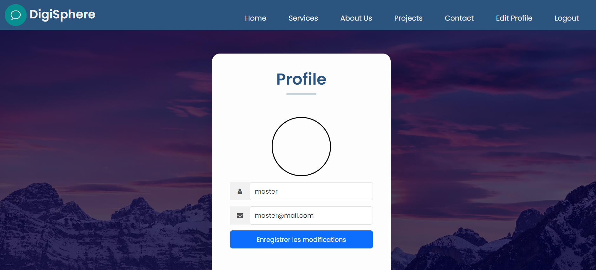
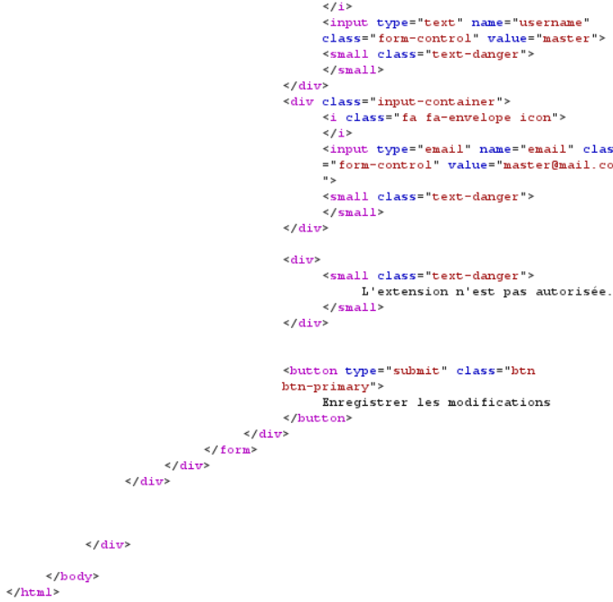
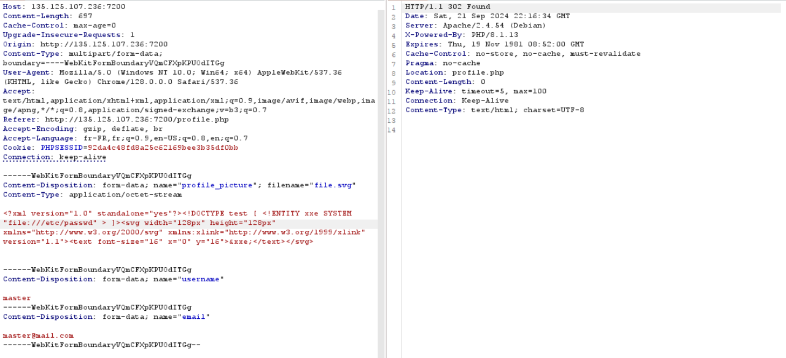
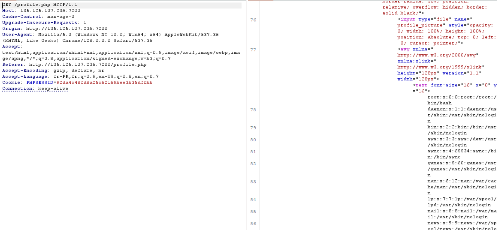
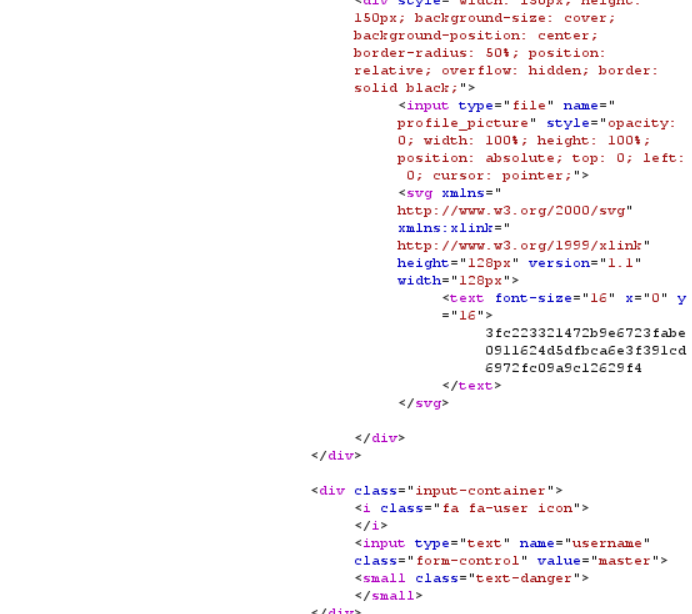

# **_DigiSphere_**
### Medium: 500 (400) pts

> DigiSphere is seeking your services to conduct a security audit of their website.

> Challmaker: sora

We have an app were we can create an account and login.

There really isn't not much to do a part from that so heading right to the `Edit Profile` we see something interesting.

Here we can upload an image so this makes me instantly think to a `php file upload` or something like that. Firing up burp and trying some stuff we realize that we're quite limited in terms of allowed extensions. We almost always get this:

But the standart image extension are still allowed

- `png`
- `jpeg`
- `jpg`
  
And the most interesting thing is that the `svg` extension is also allowed.

I then decided to try an `XXE via svg file`.

I uploaded the file...

And after the redirection we got this

Nice. Now we just have to find the path to the flag which was in our case `/.flag.txt`

##### _By w1z0z - (l3gm1nn)_